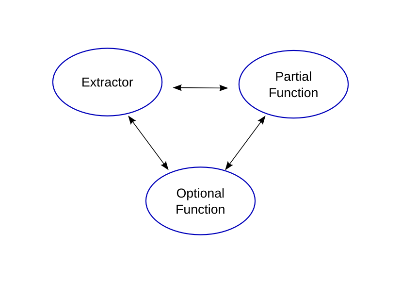
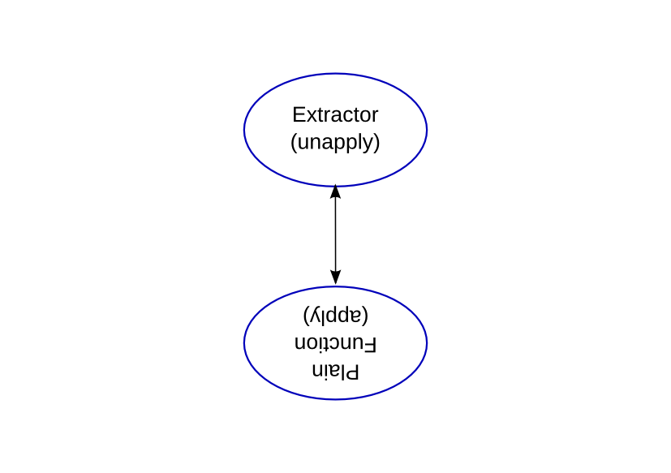

# [Stupid] Pattern Matching Tricks

Arnold deVos

    @a4dev
    adv-contact-trick@langdale.com.au

---
# This is pattern matching:

    !scala
    case class Song( n: Int, thing: String)
    val s = Song( 10, "green bottles")

    val Song(10, x) = s
    val y = s match { case Song(10, thing) => thing }
    val z = for( Song(10, thing) <- Some(s) ) yield thing 

---
# This is a partial function:

    !scala
    val pf: PartialFunction[Song, String] = { 
      case Song(10, thing) => thing 
      case Song(_, thing) => thing + ", but not 10 of them"
    }

    val a = pf(s)

---
# Here is an extractor:

    !scala
    object ExtractCount {
      def unapply(s: Song) = Some(s.n)
    }

    val b = s match { case ExtractCount(n) => n + " things" }

---
# Here is an optional function:

    !scala
    object countOption extends (Song => Option[Int]) {
      def apply(s: Song) = Some(s.n)
    }
   
    val c = countOption(s) map { _ + " things" } getOrElse { 
                throw new MatchError(s) }

---
# Different forms, convertable:

---
# Extractor as an inverse function:

